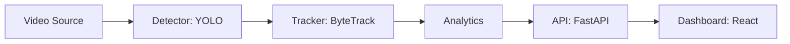

# Real-Time Smart Retail Video Analytics Pipeline

[](https://github.com/somiaamari/realtime-retail-analytics/actions/workflows/ci.yml)
[](https://www.python.org/)
[](LICENSE)
[](https://github.com/astral-sh/ruff)

A production-oriented foundation for a real-time smart retail video analytics pipeline. The planned system will combine video ingestion, YOLO object detection, ByteTrack multi-object tracking, retail analytics, and a FastAPI/React dashboard, with ONNX and TensorRT optimization as later milestones. Phase 1 established a reproducible Python package, configuration, logging, quality tooling, and CI. Phase 2 adds video ingestion, baseline YOLO detection, annotation, and latency measurement.

## Planned architecture



## Roadmap

- [x] Phase 1: Foundation
- [x] Phase 2: Video I/O & baseline detection
- [ ] Phase 3: Tracking
- [ ] Phase 4: Analytics engine
- [ ] Phase 5: Dataset & fine-tuning
- [ ] Phase 6: Evaluation & benchmarking
- [ ] Phase 7: Model optimization (ONNX/TensorRT)
- [ ] Phase 8: Real-time streaming pipeline
- [ ] Phase 9: Backend API
- [ ] Phase 10: Dashboard
- [ ] Phase 11: Docker/tests/CI-CD
- [ ] Phase 12: Docs/demo/release

## Quickstart

```shell
git clone https://github.com/somiaamari/realtime-retail-analytics.git
cd realtime-retail-analytics
python -m venv .venv
```

Activate the environment (`.venv\Scripts\activate` on Windows, or
`source .venv/bin/activate` on Linux/macOS), then install and test:

```shell
python -m pip install --upgrade pip
python -m pip install -r requirements-dev.txt
python -m pip install -e .
pytest --cov=vision_pipeline --cov-report=term-missing
```

## Quickstart: run detection on a video

Install the optional detection dependencies (PyTorch and Ultralytics) and put a
video in `data/raw/`:

```shell
python -m pip install -e ".[detection]"
python scripts/run_detection.py --source data/raw/my_video.mp4 --output outputs/detected.mp4
```

The default model is `models/yolov8n.pt`; set `model.weights_path` in
`configs/default.yaml` (or use `--weights`) to select `yolo11n.pt` instead.
The first run downloads official model weights as needed. To benchmark a
source without keeping an annotated output, run
`python scripts/benchmark_baseline.py --source data/raw/my_video.mp4 --frames 100`.
See [the Phase 2 guide](docs/phase-02-baseline-detection.md) for webcam/RTSP,
configuration, and benchmark details.

### Phase 2 demo


See [CONTRIBUTING.md](CONTRIBUTING.md) for local quality checks and contribution
guidance. The package version is available as `vision_pipeline.__version__`.
