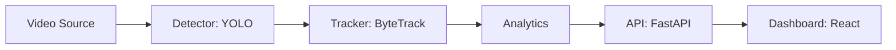

# Planned architecture

This document outlines the intended high-level data flow. Detection, tracking,
analytics, API, and dashboard implementations will arrive in later roadmap
phases.

The Phase 1 Python package provides validated YAML configuration, consistent
logging, and package boundaries for the planned processing components.
