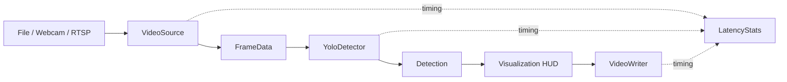

# Phase 2: Video I/O and baseline detection

Phase 2 introduces a testable OpenCV ingestion/writer layer, an optional
Ultralytics YOLO wrapper, annotations, and stage-by-stage latency measurements.
Tracking, retail analytics, fine-tuning, and model optimization remain out of
scope.

## Design

- `FrameData` and `Detection` are immutable typed values shared between modules.
- `VideoSource` provides one open/read/release interface for local files,
  webcams, and RTSP. File sources return `None` at end-of-file; RTSP retries
  failed reads with bounded exponential backoff.
- Resizing is opt-in (`video.resize: true`) and scales frames to fit within
  configured `video.width` and `video.height` without stretching.
- `YoloDetector` imports Ultralytics only when instantiated. Configure weights,
  confidence/IoU thresholds, inference size, device, and class names/IDs under
  `model`. The default class filter is COCO `person` (ID 0).
- Output videos use OpenCV `mp4v` by default. The benchmark uses a temporary
  MJPG video to include draw/write stages without retaining a second output.
- `StageTimer` reports elapsed wall-clock milliseconds; `FPSMeter` reports a
  rolling arrival-rate estimate. Warmup is excluded from measured frame FPS.
- YOLO's inference call includes model-side result decoding into `Detection`
  objects; the separate `postprocess` timer measures application-level
  normalization. These numbers are stage timings for the complete baseline,
  not an internal breakdown of Ultralytics' tensor postprocessing.

  For example, either a class name or numeric COCO class ID can select people:

  ```yaml
  model:
    weights_path: models/yolo11n.pt
    classes: ["person"]
  ```



## Install and run

Install the package and optional detector dependencies:

```shell
python -m pip install -e ".[detection]"
```

To detect people in a file and write annotated output:

```shell
python scripts/run_detection.py --source data/raw/my_video.mp4 --output outputs/detected.mp4
```

Options include `--weights models/yolo11n.pt`, `--conf 0.35`, `--device cuda`,
`--max-frames 300`, `--show`, and `--no-save`. The CLI defaults and thresholds
can also be changed in `configs/default.yaml`. The detector auto-selects CUDA,
then Apple MPS, then CPU when `model.device` is `auto`. YOLOv8n and YOLO11n
weights are both supported by changing only `model.weights_path`.

To use a webcam, configure `video.source: 0` (or pass `--source 0`). To use an
RTSP stream, pass its URL with `--source rtsp://...`; adjust
`video.max_retries` and `video.reconnect_delay_s` for the desired bounded retry
policy. Avoid sharing RTSP URLs that contain credentials.

## Baseline benchmark

Run a repeatable fixed-frame baseline with warmup:

```shell
python scripts/benchmark_baseline.py --source data/raw/my_video.mp4 --weights models/yolov8n.pt --device auto --imgsz 640 --frames 100 --warmup 5
```

The script writes `benchmarks/baseline_<device>_<model>.json` and appends a row
to `benchmarks/README.md`. The JSON retains the full host description and the
mean, median, p95, p99, minimum, and maximum for each measured pipeline stage.
The Markdown table reports overall measured FPS and `mean/p95` milliseconds
per stage. Benchmark values depend on the video codec, frame dimensions,
hardware, driver, model weights, and power/thermal state; compare runs made
under equivalent conditions. The repository's initial table is intentionally
empty until a real detector benchmark has been run locally.

The CI/test suite uses fake detections and synthetic temporary videos. It does
not download weights, install PyTorch, or require network access.
